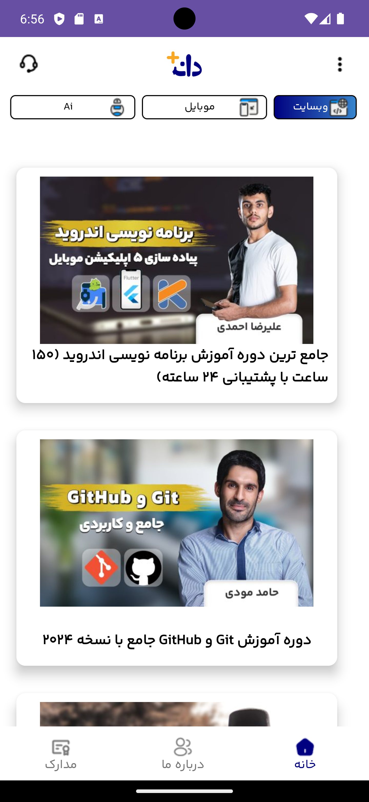
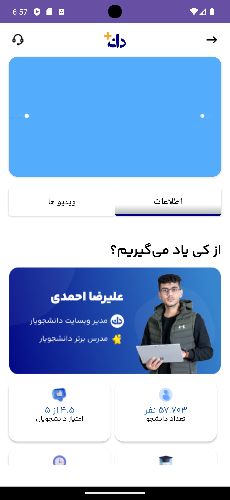
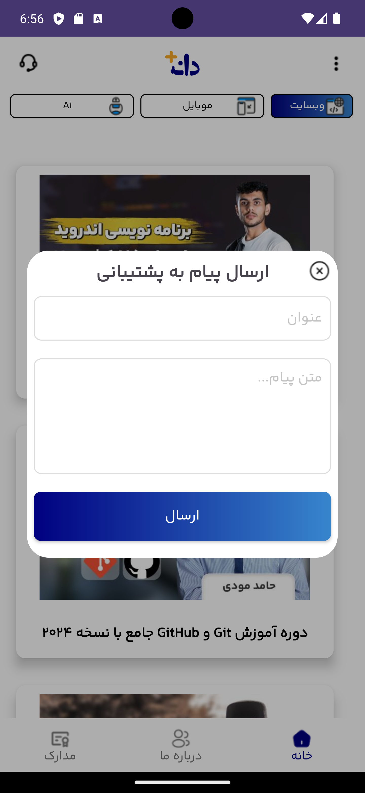

# 📽️ Video Player & Learning Platform

## 📜 Description  
**Video Player** is a professional Android application designed for streaming and managing educational video content.  
Built with a focus on performance and user experience, the app categorizes content into specialized fields such as **AI, Web Development, Mobile Development, and WordPress**.  
The project follows a clean architecture with the **Repository Pattern** and **ViewBinding**, ensuring a responsive and maintainable codebase. Integrated with **Retrofit** for seamless API communication, it provides a robust platform for modern learning.

[**Download APK 🚀**](#) *(Add your link here)*

## ✨ Features
- 🚀 **Categorized Learning:** Dedicated sections for AI, HTML, Mobile, Website, and WordPress.
- 🎬 **Smooth Video Playback:** High-quality video streaming with a custom player interface.
- 🎫 **Support System:** Integrated ticket system to communicate with instructors via Telegram.
- 📱 **Modern UI:** Built using Google's Material Design components for a sleek look.
- 🌐 **Online Sync:** Real-time data fetching using Retrofit and GSON.
- 🛠️ **Robust Error Handling:** Custom "No Internet" and error states for a better UX.

## 🛠️ Built With

| Category                  | Technology                     |
|---------------------------|---------------------------------|
| 🏛 Architecture            | Repository Pattern / MVVM       |
| 🖼️ UI Framework            | [XML Layouts & ViewBinding](https://developer.android.com/topic/libraries/view-binding) |
| 🌐 Networking              | [Retrofit 2](https://square.github.io/retrofit/) |
| 📦 Data Parsing            | [GSON](https://github.com/google/gson) |
| 🎨 Design                  | [Material Design 3](https://m3.material.io/) |
| ⌨️ Language                | [Kotlin](https://kotlinlang.org/) |

## 📱 Screenshots

<table style="width:100%"> 
  <tr> 
    <th>Home Screen</th> 
    <th>Video Details</th>  
    <th>Support Dialog</th>  
  </tr> 
  <tr> 
    <td></td>  
    <td></td> 
    <td></td> 
  </tr> 
</table>

## ⚙️ Setup & Installation
1. Clone the repository:
   ```bash
   git clone https://github.com/your-username/videoPlayer.git
   ```
2. Open the project in **Android Studio**.
3. Build the project and run it on an emulator or physical device.

---
Developed with ❤️ by **Yasin Moridi**
